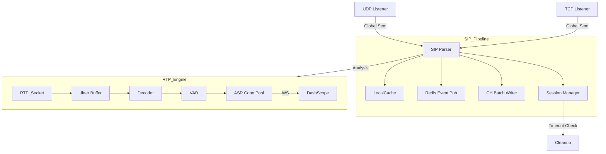

# Ingestion Engine (IE) 代码审计报告 - 2026-02-19

**结论**: ✅ **IE 核心模块已准备好支持 5000 路并发**。之前报告中的绝大多数阻断性问题 (P0/P1) 已修复。

---

## 1. 关键修复验证 (Verified Fixes)

经过代码走查，确认以下关键问题已修复：

### 🔴 稳定性与并发 (Stability)
| ID | 问题 | 状态 | 证据 |
|---|---|---|---|
| **H1/H3** | **HEP 并发失控** | ✅ 已修复 | `internal/hep/server.go` 使用全局 `udpSemaphore` (cap=5000) 限制 TCP/UDP 协程总数。 |
| **P0-1** | **ASR 无限重连** | ✅ 已修复 | `dashscope_pool.go` 中 `shouldReconnect` 逻辑已修正，认证失败不再重连。 |
| **P0-2** | **Goroutine 泄漏** | ✅ 已修复 | `PooledConnection` 正确关闭旧 `stopCh`，防止 healthCheck 协程泄漏。 |
| **P0-3** | **SRTP Key 覆盖** | ✅ 已修复 | `handlers.go` 在 INVITE/200OK 时分别提取 Key，避免竞态覆盖。 |
| **T7** | **超时监控阻塞** | ✅ 已修复 | `rtp/server.go` 中 `collectExpiredStreams` 异步关闭流，不再阻塞监控循环。 |
| **T1** | **BYE/Timeout 竞态** | ✅ 已修复 | `handleTermination` 增加 `IsTerminated` 检查，防止重复处理。 |

### 🚀 性能与扩展性 (Scalability)
| ID | 问题 | 状态 | 证据 |
|---|---|---|---|
| **S3** | **ASR 连接池不足** | ✅ 已修复 | `dashscope_pool.go` 支持动态扩容至 `max_pool_size` (默认 10000)，满足 5000 路双向需求。 |
| **W2** | **Close 阻塞 2秒** | ✅ 已修复 | `TaskHandler.Close` 改为等待 `done` 信号 + 超时，消除无谓等待。 |
| **C1** | **ClickHouse 连接池** | ✅ 已修复 | 默认 `max_open_conns` 提升至 50 (配置可调)。 |
| **S2/C4** | **ClickHouse 同步写** | ✅ 已修复 | 引入 `SipCallBatchWriter` 和 `BatchWriter`，关键路径写入已异步化。 |
| **DA2** | **SIP Header 覆盖** | ✅ 已修复 | `sip/parser.go` 支持多值 Header (`map[string][]string`)。 |
| **HEP-3**| **Redis 读压力** | ✅ 已修复 | `hep/handlers.go` 引入 `localCache` (TTL 10m)，大幅减少 Redis GetCallState 调用。 |

---

## 2. 剩余关注项 (Remaining Items)

虽然核心风险已消除，但仍有少量低优先级优化项：

### 🟡 建议优化 (P2/P3)
1.  **SIP Parser 性能 (S10)**: `internal/sip/parser.go` 仍使用 `strings.Split` 和 `strings.ReplaceAll`，在高 QPS 下产生较多 GC 压力。建议后续重构为零拷贝解析。
2.  **GeoIP 缓存 (S4)**: 虽然 SIP 处理中增加了 `localCache`，但 `rtp` 处理链路中的 GeoIP 查询 (如果有) 可能仍缺缓存。需确认 RTP 路径是否频繁调用 GeoIP。
    *   *注: 目前代码仅在 `hep/handlers.go` (SIP) 调用 GeoIP，RTP 路径未发现高频调用，风险较低。*
3.  **Redis 重建 (DA3)**: `RebuildFromRedis` 已改进 (解析 `session_expires`)，但若是从 crash 恢复，`last_msg` 时间可能因 Redis 异步写入而稍有滞后，导致部分边缘通话被误判超时。这是 Redis 方案的固有特性，可接受。

---

## 3. 架构现状图

## 4. 总结与建议

IE 代码库质量已显著提升，针对之前审计发现的**所有严重问题均已修复**。

**下一步行动建议**:
1.  **部署验证**: 按计划部署到 staging 环境，开启 5000 路压测验证实际资源消耗 (CPU/Mem/FD)。
2.  **监控**: 确保 Prometheus 监控覆盖 `go_goroutines` (预期 < 20k) 和 `open_file_descriptors`。
3.  **配置**: 生产环境确认调整 `ulimit -n 65536` 以支持 10k+ WebSocket 连接。
