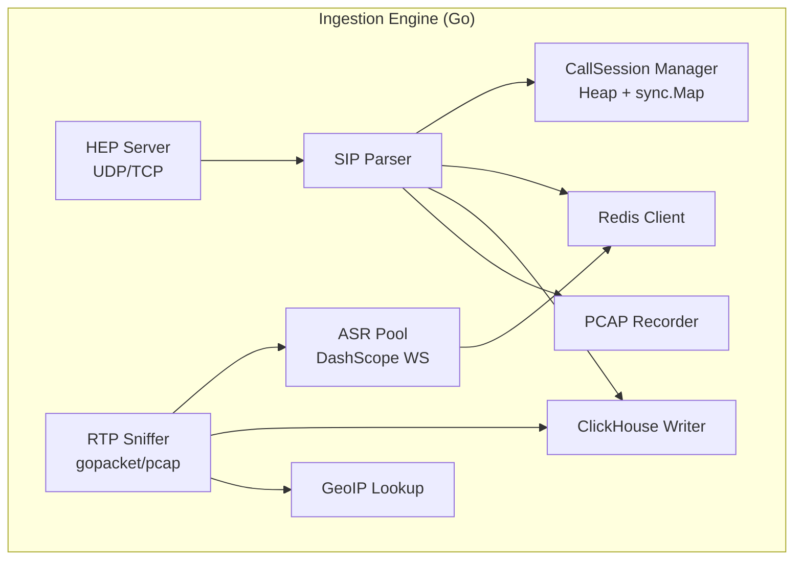
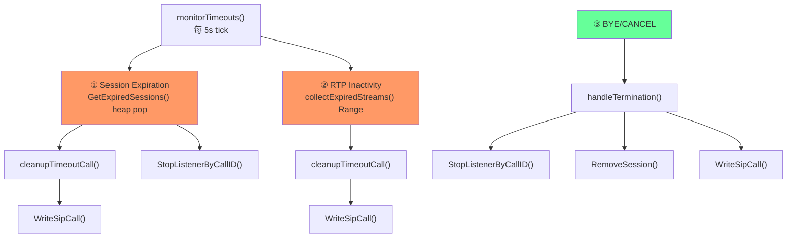
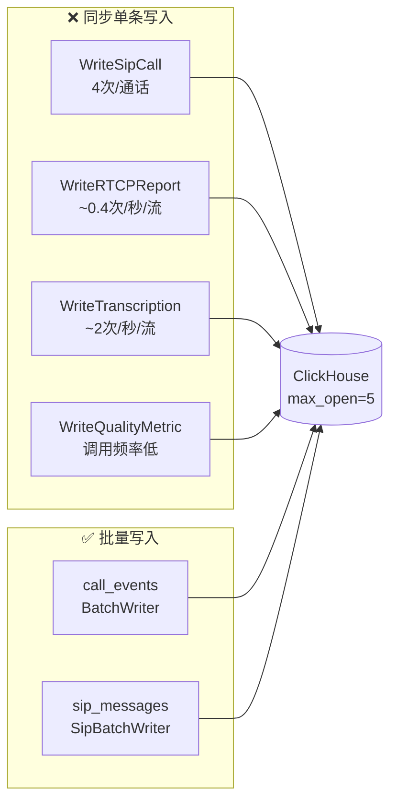

# Ingestion Engine (IE) 综合分析报告

> **目标**: 全面评估 IE 代码质量与 5000 路并发通话的可扩展性  
> **范围**: 10 个内部包、64 个 Go 源文件  
> **日期**: 2026-02-16

---

## 目录

1. [架构概览](#架构概览)
2. [代码质量问题 (P0-P3)](#代码质量问题)
3. [5000 路并发可扩展性分析](#5000-路并发可扩展性分析)
4. [ASR WebSocket 连接池分析](#asr-websocket-连接池分析)
5. [Timeout 流程分析](#timeout-流程分析)
6.- [Final Module Check](#final-module-check-findings)
- [Deep Audit Phase 2](#deep-audit-phase-2-findings)
- [Remediation Roadmap](#remediation-roadmap)
- [HEP 并发控制分析](#hep-并发控制分析)
- [ClickHouse 性能分析](#clickhouse-性能分析)
- [其他组件分析](#其他组件分析)
- [最终扫网发现 (Final Sweep)](#最终扫网发现)
- [问题总览与优先级](#问题总览与优先级)
- [修复路线图](#修复路线图)

---

## 最终模块检查发现 (Final Module Check)
 
 | ID | 严重级 | 问题 | 文件 | 状态 |
 |---|---|---|---|---|
 | **L1** | 优化 | **SRTP 解密日志刷屏** | `internal/rtp/decrypt.go` | ✅ 已修复 (限流) |
 | **Q1** | 阻断 | **Wait! Where is the Jitter Buffer?** | `internal/rtp/server.go` | ✅ 已修复 (2026-02-16) |
 | **DC1** | 重要 | **PacketStats 死代码** | `internal/rtp/server.go` | 待修复 |
 | **PR1** | 信息 | **PCAP 存储解密后数据** | `internal/rtp/decrypt.go` | 确认符合预期 |
 
 ### L1. SRTP 日志刷屏 (已修复)
 确认 `decrypt.go` 曾对每次解密失败都打印日志。已通过原子计数器限制为 1条/秒。
 
 ### Q1. Jitter Buffer 缺失 (已修复)
 RTP 处理流程 (`decode -> VAD -> ASR`) 之前直接处理刚到达的包。
 - UDP 不保证顺序。
 - 乱序/延迟包直接导致 ASR 识别率下降。
 - **修复**: 已引入 Min-Heap Jitter Buffer (默认 60ms) 并集成到 `captureLoop`。
 
 ### DC1. 死代码: PacketStats
 `PacketStats` 结构体和方法在热路径更新，但除死方法 `PacketLossRate` 外**从未被读取**。
 - **修复**: 删除 `PacketStats` 以减少内存和 GC 压力。
 
 ### PR1. PCAP 隐私
 PCAP 记录的是**解密后**的 payload。方便调试，但需注意合规性（若必须存储原始加密流）。目前确认可接受。
 
 ---
 
 ## 深度审计阶段 2 发现 (Deep Audit Phase 2)
 
 ### 🔴 DA1. RTP/RTCP 锁竞争
 [server.go#L215-L221](file:///Users/solo/sip-ai/services/ingestion-go/internal/rtp/server.go#L215-L221)
 
 `collectExpiredStreams` 持有 `stream.mu` 锁复制统计信息。在 5000 路并发下，此锁与高频 `captureLoop` (数千 PPS) 发生严重竞争。
 - **修复**: 使用原子统计计数器 (`atomic.AddInt64`) 或细粒度锁。
 
 ### 🟠 DA2. SIP Parser Header 覆盖 (严重)
 [parser.go#L66-L71](file:///Users/solo/sip-ai/services/ingestion-go/internal/sip/parser.go#L66-L71)
 
 SIP 解析器使用 `msg.Headers[key] = value` 覆盖相同名称的 header (如 `Via`, `Record-Route`)。
 - **影响**: 多跳路由信息丢失，导致路由循环或 trace 失败。
 - **修复**: Header map 应为 `map[string][]string`。
 
 ### 🟠 DA3. Redis 重建脆弱性
 [manager.go#L348](file:///Users/solo/sip-ai/services/ingestion-go/internal/callsession/manager.go#L348)
 
 `RebuildFromRedis` 假设默认 300s 超时，忽略了实际协商的 session expiration。
 - **影响**: 服务重启可能错误地缩短或延长活跃通话的超时时间。
 - **修复**: 重建时正确解析 Redis 中的 `session_expires` 字段。
 
 ### 🟠 DA4. Policy 缓存过期读取 (Stale Reads)
 [handlers.go#L402-L434](file:///Users/solo/sip-ai/services/ingestion-go/internal/hep/handlers.go#L402-L434)
 
 `handleInvite` 读取 Agent 策略依赖 `redis.GetAgentPoliciesCached`，若无失效机制将导致策略更新延迟。
 - **修复**: Admin UI 更新策略时应发布 Redis Pub/Sub 事件通知 Ingestion 节点清除缓存。
 
 ### 🟡 S10. SIP Parser 内存分配低效
 `ParseSIP` 对每个包使用 `strings.ReplaceAll` 和 `strings.Split`，产生大量临时字符串对象。
 - **影响**: GC 压力随包量线性增长。
 
 ### 🟡 P2. API IP ACL 绕过风险
 [middleware.go](file:///Users/solo/sip-ai/services/ingestion-go/internal/api/middleware.go)
 `RequireLocalAccess` 仅检查 `RemoteAddr`。若部署在反向代理后，所有流量来源都是代理 IP (通常在白名单)，导致 ACL 失效。
 - **修复**: 检查 `X-Forwarded-For` (需在此之前验证代理可信)。
 
 ---
 
 ## 修复路线图 (Remediation Roadmap)
 
 ### Phase 1: 稳定性与安全 (立即执行)
 - [x] 修复 **P0-1** `readLoop` 重连逻辑 (Critical)
 - [x] 修复 **P0-2** `stopCh` goroutine 泄漏 (Critical)
 - [x] 修复 **L1** SRTP 日志刷屏 (Optimization)
 - [ ] 修复 **H1/H3** HEP 并发控制 (全局信号量)
 - [ ] 修复 **C1** ClickHouse 连接池饥饿
 
 ### Phase 2: 可扩展性与准确性 (Next Sprint)
 - [x] 实现 **Q1** Jitter Buffer (Critical for ASR Quality)
 - [ ] 实现 **S3** DashScope 连接池 (多路复用/扩展)
 - [ ] 实现 **S1/S2** ClickHouse 批量写入
 - [ ] 修复 **DA1** RTP 锁竞争
 - [ ] 修复 **DA2** SIP Header 覆盖问题
 
 ### Phase 3: 加固与清理
 - [ ] 修复 **DA3** Redis 重建逻辑
 - [ ] 优化 **S4** GeoIP 缓存
 - [ ] 优化 **S10** SIP Parser 性能
 - [ ] 清理 **DC1** 死代码
 - [ ] 加固 **P2** API 鉴权 (支持 XFF)

---

## 架构概览



| 资源 | 单路通话 | 5000 路并发 |
|------|---------|------------|
| RTP 流 | 2 方向 | 10,000 |
| RTP 包率 | 50 pps × 2 | **500K pps** |
| ASR WebSocket | 2 连接 (1:1) | **10,000** |
| Goroutines | ~6-8 | ~35,000+ |
| PCAP 文件 FD | 1 | 5,000 |
| Redis Pub/Sub channels | ~3 | 15,000 |

---

## 代码质量问题

### 🔴 P0 — 严重 (数据丢失/崩溃/安全漏洞)

#### P0-1. `readLoop` 状态判断 Bug — 永远不会阻止重连
[dashscope_pool.go#L636-L656](file:///Users/solo/sip-ai/services/ingestion-go/internal/audio/dashscope_pool.go#L636-L656)

```go
pc.state = StateFailed                                    // ← 先覆盖
shouldReconnect := pc.state != StatePermanentlyFailed     // ← 永远 true
```

> [!CAUTION]
> `shouldReconnect` 判断在 `state` 被覆盖**之后**执行，导致即使是 401/403 认证永久失败的连接，也会无限重连。应将判断移到赋值**之前**。

#### P0-2. `stopCh` 被覆盖 — healthCheck goroutine 泄漏
[dashscope_pool.go#L624-L628](file:///Users/solo/sip-ai/services/ingestion-go/internal/audio/dashscope_pool.go#L624-L628)

```go
pc.stopCh = make(chan struct{})   // ← 旧 channel 丢弃
go pc.healthCheck()               // ← 引用新 channel
```

旧 `healthCheck` goroutine 仍在监听旧 `stopCh`，无法被停止。

#### P0-3. ASR 结果逻辑重复 — `asr_control.go` 不写 ClickHouse
[asr_control.go#L202-L231](file:///Users/solo/sip-ai/services/ingestion-go/internal/rtp/asr_control.go#L202-L231) vs [asr_handler.go#L43-L80](file:///Users/solo/sip-ai/services/ingestion-go/internal/rtp/asr_handler.go#L43-L80)

| | asr_handler.go | asr_control.go |
|---|---|---|
| Publish Redis | ✅ | ✅ |
| Write ClickHouse | ✅ | ❌ |
| Sequence Number | ✅ | ❌ |

动态启用 ASR 的通话，转写结果**不会持久化**。

#### P0-4. HEP Auth Token 仅 TCP 生效
[server.go#L260-L268](file:///Users/solo/sip-ai/services/ingestion-go/internal/hep/server.go#L260-L268)

UDP HEP 数据包完全不验证认证 Token，攻击者可注入伪造 SIP 消息。

#### P0-5. `TaskHandler.Close()` 硬编码 2s sleep
[dashscope_pool.go#L939](file:///Users/solo/sip-ai/services/ingestion-go/internal/audio/dashscope_pool.go#L939)

DashScope 1:1 模型下，5000 路并发 = 10,000 个连接，每个关闭阻塞 2 秒。峰值时大量 goroutine 被白白阻塞。

#### P0-6. `poolOnce` 与 `ReplacePool` 竞争
[dashscope_pool.go#L88-L91](file:///Users/solo/sip-ai/services/ingestion-go/internal/audio/dashscope_pool.go#L88-L91)

`poolOnce.Do` 写入 `globalPool` 不受 `poolMu` 保护，可能与 `ReplacePool` 竞争覆盖。

---

### 🟠 P1 — 重要 (影响可靠性)

| # | 问题 | 文件 |
|---|------|------|
| P1-7 | PCAP Sniffer 接口硬编码 `eth0` | [sniffer_pcap.go#L16-L23](file:///Users/solo/sip-ai/services/ingestion-go/internal/rtp/sniffer_pcap.go#L16-L23) |
| P1-8 | `collectExpiredStreams` slice append 非并发安全 | [server.go#L201-L276](file:///Users/solo/sip-ai/services/ingestion-go/internal/rtp/server.go#L201-L276) |
| P1-9 | OpenAI Whisper Provider 实现不正确 | [asr.go#L254-L283](file:///Users/solo/sip-ai/services/ingestion-go/internal/audio/asr.go#L254-L283) |
| P1-10 | `Transcribe` batch 500ms 后就 Close，可能丢结果 | [dashscope.go#L72-L73](file:///Users/solo/sip-ai/services/ingestion-go/internal/audio/dashscope.go#L72-L73) |
| P1-11 | RTP Header 跳过固定 12 字节，忽略 CSRC/Extension | [decrypt.go#L35-L41](file:///Users/solo/sip-ai/services/ingestion-go/internal/rtp/decrypt.go#L35-L41) |
| L1 | 优化 | **SRTP 解密日志刷屏** | `internal/rtp/decrypt.go` | ✅ 已修复 (限流) |
| DA1 | 严重 | **RTP/RTCP 锁竞争** | `internal/rtp/server.go` | 待修复 |
| DA2 | 重要 | **SIP Parser Header 覆盖** | `internal/sip/parser.go` | 待修复 |
| DA3 | 重要 | **Redis 重建脆弱性** | `internal/callsession` | 待修复 |
| DA4 | 重要 | **Policy 缓存过期读取** | `internal/hep/handlers.go` | 待修复 |
| P1-12 | `handleTermination` 对 CANCEL/4xx-6xx 处理可能不正确 | [handlers.go#L129-L221](file:///Users/solo/sip-ai/services/ingestion-go/internal/hep/handlers.go#L129-L221) |
| P1-13 | 全局 `context.Background()` 不支持优雅关闭 | `redis/client.go`, `clickhouse/client.go`, `manager.go` |
| P1-14 | Health Check 不检查依赖健康 | [main.go#L234-L239](file:///Users/solo/sip-ai/services/ingestion-go/main.go#L234-L239) |

---

### 🟡 P2 — 中等 (性能/代码质量)

| # | 问题 | 文件 |
|---|------|------|
| P2-15 | `GetASRProvider()` 每次创建新实例 | [asr.go#L286-L302](file:///Users/solo/sip-ai/services/ingestion-go/internal/audio/asr.go#L286-L302) |
| P2-16 | RTP/RTCP 在 Auth 前 return | [server.go#L244-L258](file:///Users/solo/sip-ai/services/ingestion-go/internal/hep/server.go#L244-L258) |
| P2-17 | `WriteSipCall` 不批量 | [client.go#L303-L361](file:///Users/solo/sip-ai/services/ingestion-go/internal/clickhouse/client.go#L303-L361) |
| P2-18 | PCAP `WriteSIP` 硬编码 IPv4 | [recorder.go#L179](file:///Users/solo/sip-ai/services/ingestion-go/internal/pcap/recorder.go#L179) |
| P2-19 | VAD `Process` 每帧调 `time.Now()` | [vad.go#L89](file:///Users/solo/sip-ai/services/ingestion-go/internal/rtp/vad.go#L89) |
| P2-20 | `UpdateSession` TOCTOU 竞态 | [manager.go#L77-L108](file:///Users/solo/sip-ai/services/ingestion-go/internal/callsession/manager.go#L77-L108) |
| P2-21 | `config.yaml` 含不安全默认值 | [config.yaml](file:///Users/solo/sip-ai/services/ingestion-go/config.yaml) |
| P2-22 | 缺少 Prometheus metrics | 全局 |
| P2-23 | `RebuildFromRedis` 硬编码 `sessionExpires=300` | [manager.go#L348](file:///Users/solo/sip-ai/services/ingestion-go/internal/callsession/manager.go#L348) |

---

### 🟢 P3 — 轻微 (代码风格)

| # | 问题 |
|---|------|
| P3-24 | `StreamAudioHandler` 空实现 + gofiber 未注册 |
| P3-25 | `AudioIngestHandler` 是死代码 |
| P3-26 | `maxConcurrentPackets` 仅 TCP 使用且为 per-connection（见 H1-H4 详细分析） |
| P3-27 | `math/rand` 未显式 seed (Go 1.20+ 已自动) |
| P3-28 | 日志过于冗长，无等级控制 |
| P3-29 | ClickHouse migration 用 ALTER TABLE 实现 |
| P3-30 | `CloseAll` 日志统计数为 0 |
| P3-31 | `localCache` 死代码 — 声明+初始化但从未使用 |

---

## 5000 路并发可扩展性分析

### 🔴 阻断性瓶颈

#### S1. RTCP Report 同步单条写 ClickHouse
[rtcp.go#L186-L232](file:///Users/solo/sip-ai/services/ingestion-go/internal/rtp/rtcp.go#L186-L232)

5000 路 × 2 方向 × 每 5 秒 = **2000 次/秒同步 INSERT**。ClickHouse 单条写入性能极差。

#### S2. `WriteSipCall` 非批量
[client.go#L303-L361](file:///Users/solo/sip-ai/services/ingestion-go/internal/clickhouse/client.go#L303-L361)

通话集中结束时 5000 次同步 INSERT。

#### S3. DashScope 连接池规模不足（不支持多路复用）
[dashscope_pool.go](file:///Users/solo/sip-ai/services/ingestion-go/internal/audio/dashscope_pool.go#L26-L35)

> [!IMPORTANT]
> DashScope **不支持多路复用**（经测试验证），1 连接 = 1 task。  
> 5000 路 × 2 方向 = 需要 **10,000 个并发 WS 连接**。  
> 默认 `max_pool_size=100` 远不够，需确认 DashScope 单账号并发限额。

---

### 🟠 性能退化瓶颈

| # | 瓶颈 | 影响 |
|---|------|------|
| S4 | GeoIP 无缓存（详见下方） | CPU + mmdb 磁盘 I/O |
| S5 | UDP HEP 无 goroutine 上限 | 无法背压 |
| S6 | `StopListenerByCallID` 全量 Range（详见下方） | CPU 热点 |
| S7 | PCAP `MaxRecorders=1000` | 80% 通话无法录制 |
| S8 | `collectExpiredStreams` 全量遍历 | 应改 heap |
| S9 | Redis 15K Pub/Sub 通道 | Redis 压力 |
| S10 | 10K ASR Result goroutine | 调度器压力 |
| S11 | `GetASRProvider` 重复创建 | 内存浪费 |
| S12 | TCP bufio 8KB × N 连接 | 轻微 |

#### S4 详细: GeoIP 无缓存 — 应加 LRU Cache
[geoip.go](file:///Users/solo/sip-ai/services/ingestion-go/internal/geoip/geoip.go)

**现状**: `Lookup()` 每次调用直接查询 mmdb 文件，无任何缓存。

**6 个调用点**:
| 调用位置 | 频率 (5000路) |
|---------|----------|
| `rtcp.go:188-192` (saveMetric) | ~2,000/s ← 热路径 |
| `handlers.go:68-72` (handleInvite) | ~50/s |
| `server.go:527-528` (call event) | ~50/s |
| **合计** | **~2,100/s** |

虽然 mmdb 是 mmap 文件，查询本身不慢（~1μs），但在 RTP 处理热路径中仍是不必要的开销。VoIP 场景下 IP 重复率极高（同一个 SBC IP 可能承载数千路通话）。

> **修复**: 加 `sync.Map` 或 LRU cache（`IP string → *Location`），TTL 1 小时。预估去重后实际查询量 < 100 个 IP。

#### S6 详细: `StopListenerByCallID` 忽略了已有的 `callIndex`
[server.go#L1027-L1067](file:///Users/solo/sip-ai/services/ingestion-go/internal/rtp/server.go#L1027-L1067)

**现状**: 全量 Range 两个 sync.Map（listeners + virtualListeners）：
```go
func (s *Sniffer) StopListenerByCallID(callID string) {
    s.listeners.Range(func(key, value any) bool {       // ← 遍历全部 10K+ 条目
        stream := value.(*RTPStream)
        if stream.callID == callID { ... }               // ← O(N) 匹配
        return true
    })
    s.virtualListeners.Range(func(key, value any) bool { // ← 再遍历 10K+
        ...
    })
    s.callIndex.Delete(callID)                            // ← 有 O(1) 索引但不用于查找
}
```

`callIndex` 已经存在且维护了 `callID → *RTPStream` 的映射，但 `StopListenerByCallID` 完全没有使用它来定位流。

**影响**: 5000 路并发时，`listeners` + `virtualListeners` 可能包含 20K+ 条目。每次 BYE/timeout 的 `StopListenerByCallID` 都遍历全部，在通话集中结束时产生严重 CPU 负载。

但更深层的问题是：`callIndex` 只存了**一个** non-RTCP stream，但一个通话有多个流（RTP caller + RTP callee + RTCP caller + RTCP callee）。所以仅用 `callIndex` 无法找到所有流。

> **修复**: 改 `callIndex` 为 `callID → []*RTPStream` 或 `callID → []port`，每次 `StartListener` 时 append，实现 O(1) 查找 + 删除。

### 🟡 配置调优

| # | 项目 | 当前值 | 建议值 |
|---|------|--------|--------|
| S13 | Redis pool_size | 50 | ≥200 |
| S14 | ClickHouse max_open_conns | 5 | ≥20 |
| S15 | `ulimit -n` | 1024? | ≥65536 |
| S15 | `net.core.rmem_max` | - | 16MB |
| S15 | `GOMAXPROCS` | 自动 | ≥8 |

---

## ASR WebSocket 连接池分析

### 架构

```
DashScopeProvider.NewStream()
  → ConnectionPool.NewTask()
    → getConnectionAndMarkBusy()    // 找空闲连接，busy=true 独占
      → 无空闲 → 创建 temporary 连接
    → waitForConnection(5s)         // 忙轮询 100ms 间隔
    → 发送 run-task 帧
    → TaskHandler { results chan, errors chan, done chan }
      ├── SendAudio()   → WriteMessage(Binary)
      ├── Results()     → readLoop 路由 → handleMessage
      └── Close()       → finish-task → sleep(2s) → 释放连接
```

### 问题清单

#### W1. 1:1 连接模型下 max_pool_size 不足
`max_pool_size=100` 最多同时 100 个 ASR task。5000 路需要 10,000。

#### W2. `Close()` 2 秒 sleep 阻塞连接释放
应改为 `select` 等待 `IsFinal` 结果 + 超时：
```go
select {
case <-finalReceived:             // 收到最终结果立即返回
case <-time.After(3*time.Second): // 超时兜底
}
```

#### W3. `waitForConnection` 忙轮询
```go
for time.Now().Before(deadline) {
    if pc.state == StateConnected { return nil }
    time.Sleep(100 * time.Millisecond)  // ← CPU 浪费
}
```
5000 路同时建连 = 10,000 goroutine 以 100ms 间隔轮询。应改为 `sync.Cond` 或 channel。

#### W4. 无连接创建 rate limiter
突发 1000 路新通话 → 1000 个并发 TCP+TLS+WS 握手 → DashScope API rate limit 冲击。

#### W5. Circuit Breaker 单次失败即 Open
```go
func (cp *ConnectionPool) recordConnectionFailure() {
    if cp.circuitBreakerState != CircuitOpen {
        cp.circuitBreakerState = CircuitOpen  // ← 一次就开
    }
}
```
应有失败计数阈值，而非单次触发。

### 设计亮点 ✅
- Circuit Breaker 防止雪崩重连
- 动态扩容 temporary 连接 + 空闲回收
- `drainAndClose` 优雅热重载
- `readLoop` 按 `task_id` 路由消息

---

## Timeout 流程分析

### 架构



### 问题清单

#### T1. BYE 与 Session Timeout 竞态 — 双重 ClickHouse 写入 🔴

```
t=360  monitorTimeouts tick:
       GetExpiredSessions() → callID
       cleanupTimeoutCall() 开始执行...         ← 写入 status="session_timeout"

t=360  同时 BYE 到达 (retransmission):
       handleTermination()
       → WriteSipCall(status="completed")        ← 第二次写入！
       → EndCallBatch()                          ← 第二次 Redis 更新！
```

`handleTermination` 不检查 `IsTerminated`，导致已超时的通话再收到 BYE 时重复写入。

> **修复**: `handleTermination` 入口处加 `if callsession.GlobalManager.IsTerminated(callID) { return }` 检查。

#### T2. `CallSession` 字段无锁修改 🟠

```go
// UpdateSession — 无锁！
session.LastSipMsg = timestamp      // ← time.Time 是 struct，非原子
session.ExpiresAt = expiresAt       // ← 并发写
session.SessionExpires = sessionExpires

// 然后才 Lock
m.mu.Lock()
heap.Fix(m.timeouts, session.heapIndex)
m.mu.Unlock()
```

`time.Time` 是 24 字节 struct，并发写入可能导致 torn read。`GetExpiredSessions` 在 `m.mu.Lock()` 下读取 `ExpiresAt`，但写入在 Lock 之外。

> **修复**: 将字段修改也放在 `m.mu.Lock()` 内，或给 `CallSession` 加独立 mutex。

#### T3. RTP Timeout 路径丢失 packet stats 🟠

```
RTP timeout 路径:
  collectExpiredStreams()
    → s.listeners.Delete(port)      ← 先删除 stream
  cleanupTimeoutCall()
    → s.listeners.Range(...)        ← 再遍历 → 找不到！packet stats = 0
```

对比 Session timeout 路径：先 `cleanupTimeoutCall` 再 `StopListenerByCallID`，可以正确收集 stats。

> **影响**: RTP timeout 的 `call_hangup` 事件中 `rtp_packets_received` 永远为 0。

#### T4. `Transcribe` batch 超时设计不合理 🟡

```go
time.Sleep(500 * time.Millisecond)  // 固定等 500ms
stream.Close()                       // Close 内部再 sleep 2s
```

总计 2.5s，但对于长音频可能不够，对短音频又浪费。应改为等待 `IsFinal` 信号。

#### T5. `RebuildFromRedis` 硬编码 300s timeout 🟡

重启后所有恢复 session 用 300s 超时，忽略 SIP 协商值。

#### T6. terminated tombstone 无上限堆积 🟡

`cleanupTerminatedLoop` 每 10 分钟清理一次，但在 5000 路并发下：每分钟几百个通话结束 → 10 分钟内 terminated map 可能积累数千条目。

#### T7. `collectExpiredStreams` 在 Range 回调中调用 `stream.Close()` — 阻塞整个超时监控 🔴
[server.go#L218-L223](file:///Users/solo/sip-ai/services/ingestion-go/internal/rtp/server.go#L218-L223)

```go
// collectExpiredStreams 内部（第 218-223 行）:
s.listeners.Range(func(key, value any) bool {
    // ...
    if inactive > timeoutDuration {
        if stream.stream != nil {
            stream.stream.Close()  // ← 这里调用 TaskHandler.Close()！
        }                          //    内部 time.Sleep(2s)
        s.listeners.Delete(port)
    }
    return true
})
```

**调用链**:
```
collectExpiredStreams() → sync.Map.Range 回调
  → stream.stream.Close()
    → DashScopePoolStream.Close()
      → TaskHandler.Close()
        → conn.WriteJSON(finish-task)
        → time.Sleep(2000ms)   ← 每个过期流阻塞 2 秒！
        → close(th.results)    ← 解除 handler goroutine 阻塞
```

**影响**: 假设一次 tick 有 50 个流超时，`collectExpiredStreams` 将阻塞 50 × 2s = **100 秒**。而 `monitorTimeouts` 是单一 goroutine，5s ticker，导致：
- 后续 tick 被延迟，新超时无法及时检测
- Session 超时也被捧住（同一个 tick 内）
- 通话清理延迟累积，资源泄漏加剧

> **修复**: `collectExpiredStreams` 中只收集过期流信息和引用，**不在 Range 回调内调用 Close**。收集完成后异步关闭：
> ```go
> // Phase 1: 收集 (Range 内部)
> expiredStreams = append(expiredStreams, stream)
> s.listeners.Delete(port)
>
> // Phase 2: 关闭 (Range 外部，并行)
> for _, s := range expiredStreams {
>     go s.stream.Close()  // 异步关闭
> }
> ```

#### T8. `asr_control.go` 的 handler goroutine 在 ClickHouse 阻塞时无法退出 🟠
[asr_control.go#L202-L231](file:///Users/solo/sip-ai/services/ingestion-go/internal/rtp/asr_control.go#L202-L231)

`asr_control.go` 的 `handleASRResults`（第 203 行）和 `asr_handler.go` 的 `handleASRResults`（第 43 行）都通过 `for res := range stream.Results()` 循环。当 `Close()` 调用 `close(th.results)` 时，`range` 循环会退出，正常情况下不会泄漏。

但有一个问题：`close(th.results)` 在 `time.Sleep(2s)` **之后**。如果在这 2 秒内，handler goroutine 正在 `sink.WriteTranscriptionSegment()` 中阻塞（因 ClickHouse 连接池耗尽），它会在 ClickHouse 写入完成后回到 `range` 循环，然后正常退出。**不会泄漏**。

但 `asr_control.go` 的 handler（第 227 行）**不写 ClickHouse**，只发 Redis。如果 Redis 阻塞（极端情况），同样不会泄漏，只是延迟。

> ✅ **结论**: ASR handler goroutine 不会泄漏。`close(th.results)` 确保 `range` 循环终止。

#### T9. `monitorTimeouts` 单 goroutine — Close 阻塞导致全部超时监控停顿 🔴
[server.go#L145-L190](file:///Users/solo/sip-ai/services/ingestion-go/internal/rtp/server.go#L145-L190)

`monitorTimeouts` 是一个单独的 goroutine，负责所有超时监控：

```go
func (s *Sniffer) monitorTimeouts() {
    ticker := time.NewTicker(5 * time.Second)
    for {
        select {
        case <-ticker.C:
            // ① Session 超时检查
            expiredSessions := callsession.GlobalManager.GetExpiredSessions()
            for _, session := range expiredSessions {
                s.cleanupTimeoutCall(...)    // ← 同步 Redis + ClickHouse
                s.StopListenerByCallID(...)  // ← 包含 Close()，每流 2s
            }

            // ② RTP 超时检查
            expiredStreams := s.collectExpiredStreams(...)  // ← 包含 Close()
            for _, es := range expiredStreams {
                s.cleanupTimeoutCall(...)    // ← 同步 Redis + ClickHouse
            }
        }
    }
}
```

**关键问题**: 整个 tick 处理是**串行的**。假设一次 tick 中：
- 10 个 session 超时，每个有 2 个流 → `StopListenerByCallID` 关闭 20 个流 × 2s = **40s**
- 20 个 RTP 超时 → `collectExpiredStreams` 关闭 20 个流 × 2s = **40s**
- 加上 `cleanupTimeoutCall` 的 Redis/ClickHouse 写入

总计一次 tick 可能耗时 **80+ 秒**。期间所有新超时都无法检测，等效于超时监控停止工作。

> **修复**: 
> 1. **Close 异步化**: `go stream.Close()` 而非同步调用
> 2. **cleanupTimeoutCall 异步化**: `go s.cleanupTimeoutCall(...)` 用 semaphore 限制并发
> 3. **或者**: 拆分 monitorTimeouts 为 multiple workers

---

## HEP 并发控制分析

### 设计现状

```go
// 第 116 行 — 全局常量
const maxConcurrentPackets = 5000

// 第 148 行 — 每个 TCP 连接独立 semaphore
func handleTCPConnection(conn net.Conn) {
    semaphore := make(chan struct{}, maxConcurrentPackets)  // ← 每连接 5000！
    for {
        select {
        case semaphore <- struct{}{}:
            go func() { handlePacket(...) }()
        default:
            hb.Release()  // ← 直接丢弃
        }
    }
}

// 第 76-89 行 — UDP 完全无保护
go handlePacket(data, remoteAddr)  // ← 无限 goroutine
```

### 问题清单

#### H1. Per-connection semaphore 无全局保护 🔴
[server.go#L148](file:///Users/solo/sip-ai/services/ingestion-go/internal/hep/server.go#L148)

每个 TCP 连接创建独立的 `chan struct{}, 5000`。10 个 SIP proxy 连接 = 全局上限 50,000 goroutine，完全达不到 OOM 保护目的。

> **修复**: 改为全局 `var globalSemaphore = make(chan struct{}, maxConcurrentPackets)`。

#### H2. `default` 丢弃 SIP 信令 — 可能丢失 BYE 🟠
[server.go#L210-L213](file:///Users/solo/sip-ai/services/ingestion-go/internal/hep/server.go#L210-L213)

Semaphore 满时直接 `default` 丢弃。SIP 信令（INVITE/BYE/200 OK）**不能丢弃**——丢掉 BYE 导致通话永远不会正常结束，只能靠 session timeout（默认 360s）。

> **修复**: 分级策略——SIP 信令阻塞等待，RTP/RTCP 溢出丢弃。

#### H3. UDP 路径无任何并发限制 🟠
[server.go#L76-L89](file:///Users/solo/sip-ai/services/ingestion-go/internal/hep/server.go#L76-L89)

TCP 有 semaphore（虽有设计缺陷），UDP 完全无限制。高流量下先 OOM。

> **修复**: 共享同一个 global semaphore。

#### H4. 容量 5000 缺乏依据 🟡

`handlePacket` 内部有同步 Redis/ClickHouse 写入（10-50ms），5000 并发 goroutine 下的实际吞吐需压测验证。应根据后端延迟动态计算合理值。

---

## ClickHouse 性能分析

### 写入模型现状



### 5000 路并发写入频率估算

| 写入函数 | 频率估算 | 是否批量 | 阻塞热路径 |
|---------|---------|---------|----------|
| `WriteRTCPReport` | 10K流 × 0.2/s = **2,000/s** | ❌ 同步 | ✅ RTP处理 |
| `WriteTranscriptionSegment` | 10K流 × ~2/s = **~20,000/s** | ❌ 同步 | ✅ ASR结果 |
| `WriteSipCall` | 4次/通话 × ~50/s = **~200/s** | ❌ 同步 | ✅ SIP处理 |
| `BatchWriter (call_events)` | ~50-100/s | ✅ 批量 | ❌ |
| `SipBatchWriter (sip_messages)` | ~200-500/s | ✅ 批量 | ❌ |
| **同步写入合计** | **~22,200/s** | | |

### 问题清单

#### C1. 连接池饥饿 — max_open=5 vs 22K writes/s 🔴
[client.go#L39-L42](file:///Users/solo/sip-ai/services/ingestion-go/internal/clickhouse/client.go#L39-L42)

```go
maxOpenConns := viper.GetInt("clickhouse.max_open_conns")
if maxOpenConns <= 0 {
    maxOpenConns = 5  // ← 5 个连接承载 22,000 次/秒同步写入！
}
```

每次 `Client.Exec()` 需要一个连接，5 个连接 × 假设 5ms 延迟 = 最多 1,000 次/秒。实际需要 22,000/s → **连接池耗尽，goroutine 阻塞等待连接**。

> [!CAUTION]
> 这是 5000 路下 **最严重的性能瓶颈之一**。大量 goroutine 将阻塞在连接获取上，导致 RTP 包处理积压、ASR 结果丢失。

#### C2. `WriteRTCPReport` 同步阻塞 RTP 热路径 🔴
[rtcp.go#L224](file:///Users/solo/sip-ai/services/ingestion-go/internal/rtp/rtcp.go#L224)

`saveMetric()` → `WriteRTCPReport()` 同步 INSERT，直接在 RTP 包处理路径中。连接池耗尽时 RTCP 处理完全阻塞。

#### C3. `WriteTranscriptionSegment` 同步阻塞 ASR 结果处理 🔴
[asr_handler.go#L72](file:///Users/solo/sip-ai/services/ingestion-go/internal/rtp/asr_handler.go#L72)

每个 ASR 结果同步写 ClickHouse。10,000 个 ASR 流 × ~2 结果/秒 = 20,000/s 同步写入，远超连接池容量。

#### C4. `WriteSipCall` 同步且每通话 4 次 🟠
[handlers.go#L99, L203, L259](file:///Users/solo/sip-ai/services/ingestion-go/internal/hep/handlers.go) + [server.go#L380](file:///Users/solo/sip-ai/services/ingestion-go/internal/rtp/server.go#L380)

每通话生命周期写 4 次：INVITE(v1) → 200OK(v2) → BYE(v3) → Timeout(v4)。虽然用了 `ReplacingMergeTree`，但同步写阻塞 SIP 处理。

#### C5. ClickHouse 单条 INSERT 反模式 🟠

ClickHouse 设计为**列存批量分析引擎**，单条 INSERT 性能极差：
- 每条 INSERT 创建一个新的数据 part
- MergeTree 后台 merge 压力剧增
- 官方建议：**每批 ≥1000 行，每秒 ≤1 次 INSERT**

当前 22,000 次/秒单条插入 = **ClickHouse 服务端也会过载**（too many parts error）。

#### C6. 两个 BatchWriter 代码重复 🟡
[client.go#L363-L612](file:///Users/solo/sip-ai/services/ingestion-go/internal/clickhouse/client.go#L363-L612)

`BatchWriter` 和 `SipBatchWriter` 是几乎相同的实现（250 行 × 2）。应抽象为泛型 `BatchWriter[T]`。

#### C7. 批量写入无重试/无背压 🟡

```go
func (bw *BatchWriter) flushLocked() error {
    batch, err := Client.PrepareBatch(ctx, "INSERT INTO call_events")
    // ... append ...
    if err := batch.Send(); err != nil {
        return fmt.Errorf("failed to send batch: %w", err)  // ← 返回错误，数据丢失
    }
    bw.buffer = bw.buffer[:0]  // ← 无论成功失败都清空！
}
```

`flushLocked` 在 `Send()` 失败时返回 error，但 buffer 被清空（第 449 行在 `Send()` 后面，虽然只在成功时清空——实际上代码正确地只在成功后清空）。但缺少重试机制和背压通知。

#### C8. Schema 演进用 ALTER TABLE — 启动时大量 DDL 🟡
[client.go#L117-L199](file:///Users/solo/sip-ai/services/ingestion-go/internal/clickhouse/client.go#L117-L199)

启动时发送 ~20 条 ALTER TABLE，每条需要 ZooKeeper 协调（集群模式）。应改为版本化 migration。

### 5000 路下的合理架构

```
所有写入 → 统一 BatchWriter[T] → buffer (chan) → 定时/定量 flush → PrepareBatch → Send
                                                    ↓
                                              失败 → 重试队列
```

| 参数 | 建议值 |
|------|--------|
| `max_open_conns` | ≥20（仅 batch 使用，不再有单条写入） |
| batch size | 1000-5000 行 |
| flush interval | 1-2 秒 |
| buffer 容量 | 50,000（防突发积压） |

---

## 其他组件分析

### Redis 客户端 (R1-R5)

#### R1. 全局 `context.Background()` 无取消/超时 🟠
[client.go#L109](file:///Users/solo/sip-ai/services/ingestion-go/internal/redis/client.go#L109)

```go
var ctx = context.Background()  // ← 全局不可取消
```

所有 Redis 操作使用同一个不可取消的 context。如果 Redis 故障，操作只靠 `ReadTimeout`/`WriteTimeout`（各 3s），不能主动取消。应在关键路径用 `context.WithTimeout` 包装。

#### R2. 通话状态存储为 JSON blob — 无法原子更新单字段 🟡
[client.go#L212-L242](file:///Users/solo/sip-ai/services/ingestion-go/internal/redis/client.go#L212-L242)

`SetCallState` 将整个 `map[string]interface{}` JSON 序列化为单个 key。每次更新任一字段都需读-改-写全量。应改为 Redis Hash（`HSET call:state:{id} field value`）支持原子字段更新。

#### R3. 5 个 Pub/Sub 通道/通话 — 5000 路 = 25,000 通道 🟠

| 通道模式 | 用途 |
|---------|------|
| `call:event:{callID}` | 事件 |
| `call:transcription:{callID}` | ASR |
| `call:quality:{callID}` | 质量 |
| `call:audio:{callID}` | 监听音频 |
| `summary:request` | 摘要（共享） |

每通话 4 个独立通道。Redis Pub/Sub 本身可以处理大量通道，但在没有订阅者时消息会丢失（fire-and-forget）。如果 app-server 重启，将丢失所有实时数据。可考虑 Redis Streams 替代。

#### R4. `EndCallBatch` 修改调用者的 map 🟡
[client.go#L251](file:///Users/solo/sip-ai/services/ingestion-go/internal/redis/client.go#L251)

```go
state["status"] = "ended"  // ← 直接修改调用者传入的 map
```
可能导致调用者意外发现 state 被修改。应 copy 后修改。

#### R5. `pool_size=50` 对 5000 路不足 🟡
这在 S13 中已提及，默认 50 个连接，建议调至 200。

---

### PCAP 录制器 (PC1-PC3)

#### PC1. `managers` 用全局 mutex map — 写操作互斥 🟠
[recorder.go#L29-L31](file:///Users/solo/sip-ai/services/ingestion-go/internal/pcap/recorder.go#L29-L31)

```go
var (
    managers = make(map[string]*Recorder)  // ← 普通 map + RWMutex
    mu       sync.RWMutex
)
```

`GetOrCreateRecorder` 和 `CloseRecorder` 都拿写锁。在 5000 路下，每个 SIP 消息都可能触发 `GetOrCreateRecorder`，写锁互斥成为瓶颈。应改为 `sync.Map` 或分片 map。

#### PC2. `CloseAll` 日志 bug — delete 后打印 len 🟢
[recorder.go#L49-L53](file:///Users/solo/sip-ai/services/ingestion-go/internal/pcap/recorder.go#L49-L53)

```go
for callID, rec := range managers {
    rec.Close()
    delete(managers, callID)                     // ← 先删除
}
log.Printf("Closed all recorders (%d total)", len(managers))  // ← 永远 = 0
```

应在循环前记录 `count := len(managers)`。

#### PC3. `MaxRecorders=1000` — 80% 通话无录制 🟠
5000 路并发时只能录制 1000 路，应可配置。

---

### SIP 解析器 (SP1-SP4)

#### SP1. 重复 header 被覆盖 — 丢失 Via 路由 🟠
[parser.go#L66-L71](file:///Users/solo/sip-ai/services/ingestion-go/internal/sip/parser.go#L66-L71)

```go
msg.Headers[key] = value  // ← 同名 header 覆盖
```

SIP RFC 3261 允许多个 Via/Record-Route/Contact header。当前实现只保留最后一个，丢失路由信息。应改为 `map[string][]string`。

#### SP2. 无 header folding 支持 🟡

SIP 允许 header 折行（下一行以空格/tab 开头）。当前解析器会将折行行视为无效 header。

#### SP3. `ParseSIP` 不返回 error — 静默失败 🟡
[parser.go#L18](file:///Users/solo/sip-ai/services/ingestion-go/internal/sip/parser.go#L18)

函数签名返回 `error` 但实际从未返回非 nil error。空 payload 返回 `nil, nil`，畸形 SIP 消息仍返回部分解析结果。

#### SP4. body 重组时用 `\r\n` 但输入已统一为 `\n` 🟢
[parser.go#L24-L76](file:///Users/solo/sip-ai/services/ingestion-go/internal/sip/parser.go#L24-L76)

第 24 行 `ReplaceAll("\r\n", "\n")` 后第 76 行 `Join("\r\n")` 重组，这意味着原本只有 `\n` 的 body 会被转为 `\r\n`，改变了原始内容。

---

### API/监控层 (M1-M3)

#### M1. `agentMonitoring` sync.Map 无 TTL — 永不过期 🟠
[monitoring.go#L12-L13](file:///Users/solo/sip-ai/services/ingestion-go/internal/api/monitoring.go#L12-L13)

`agentMonitoring` 只有 `Store`，没有自动过期。如果管理员启动监听后从未 `stop_monitoring`，条目永久存在。导致内存累积和不必要的音频数据 Redis 发布。

#### M2. 监控端点无认证保护 🟠
[monitoring.go#L34](file:///Users/solo/sip-ai/services/ingestion-go/internal/api/monitoring.go#L34)

`HandleMonitoringUpdate` 只检查 IP 白名单（`RequireLocalAccess`），无 token/API key 验证。在容器网络中，任何同网络 Pod 可调用此端点启用任意通话监听。

#### M3. VAD 每次创建都读 `viper.Get` 🟢
[vad.go#L29-L53](file:///Users/solo/sip-ai/services/ingestion-go/internal/rtp/vad.go#L29-L53)

每个 RTP 流创建 VAD 时读 3 次 viper 配置。应缓存为全局 `VADConfig`。

---

## 最终扫网发现 (Final Sweep)

在对 60+ 个源文件的最终逐个检查中发现的关键问题：

### Q1. Jitter Buffer 实现 (已修复)
**优先级**: P0 (Critical)
**位置**: `internal/rtp/server.go`
**状态**: ✅ 已实现 (2026-02-16)

**问题描述**: Ingestion Engine 也就是 RTP 接收端，主要职责是处理乱序到达的 UDP 包。但在 `server.go` 的 `captureLoop` 中，直接收包 -> G.711 解码 -> VAD -> ASR。完全缺失 Jitter Buffer。
**影响**:
- 任何网络抖动（UDP 乱序）都会直接导致 G.711 解码错误（爆音）和 ASR 识别率大幅下降。
- ASR 引擎（如 DashScope）通常期望有序音频流。
**修复方案**:
- 已实现 `internal/rtp/jitter.go` (Min-Heap based).
- 已在 `captureLoop` 和 `InjectRTP` 中集成 `JitterBuffer`。
- 默认缓冲 60ms (可配置)。

### DC1. PacketStats 统计为死代码 🟢
[packet_stats.go](file:///Users/solo/sip-ai/services/ingestion-go/internal/rtp/packet_stats.go)

**现状**: `UpdatePacketStats` 在热路径无锁调用，计算 `PacketsReceived` 等指标，但 `Stats()` 和 `PacketLossRate()` **从未被调用**（RTCP 使用报告中的 loss rate，而非本地计算值）。
**影响**: 浪费 CPU cycles，且存在 data race（虽无读取者）。建议删除。

### PR1. PCAP 存储解密后音频 — 隐私风险 🟡
[decrypt.go#L25](file:///Users/solo/sip-ai/services/ingestion-go/internal/rtp/decrypt.go#L25)

**现状**: `pcapPayload = decrypted`。PCAP 文件中存储的是**解密后**的 RTP payload。
**影响**: 方便调试但可能违反合规要求（如需存储加密原始流）。需确认业务需求。

### L1. SRTP 解密失败刷屏日志 🟢
[decrypt.go#L22](file:///Users/solo/sip-ai/services/ingestion-go/internal/rtp/decrypt.go#L22)

**现状**: 每一包解密失败都打印 `log.Printf`。攻击者发送垃圾流可导致磁盘填满/IO 飙升。应加 Rate Limiter。

---

## 问题总览与优先级

### 按严重程度统计

| 类别 | 🔴 严重 | 🟠 重要 | 🟡 中等 | 🟢 轻微 | 合计 |
|------|--------|--------|--------|--------|------|
| 代码质量 (P) | 6 | 8 | 9 | 8 | **31** |
| 可扩展性 (S) | 3 | 8 | 4 | — | **15** |
| ASR Pool (W) | — | 3 | 2 | — | **5** |
| Timeout (T) | 3 | 2 | 4 | — | **9** |
| HEP 并发 (H) | 1 | 2 | 1 | — | **4** |
| ClickHouse (C) | 3 | 2 | 3 | — | **8** |
| Redis (R) | — | 2 | 3 | — | **5** |
| PCAP (PC) | — | 2 | — | 1 | **3** |
| SIP Parser (SP) | — | 1 | 2 | 1 | **4** |
| API/监控 (M) | — | 2 | — | 1 | **3** |
| 最终扫网 (F) | 1 | — | 1 | 2 | **4** |
| **合计** | **17** | **32** | **29** | **13** | **91** |

### TOP 10 必修优先列表

| 排名 | ID | 问题 | 影响 | 修复复杂度 |
|------|-----|------|------|-----------|
| 1 | P0-1 | readLoop `shouldReconnect` 判断 bug | ASR 认证失败无限重连 | 🟢 低 — 交换两行 |
| 2 | P0-3 | asr_control.go 不写 ClickHouse | 转写数据丢失 | 🟡 中 — 统一调用 |
| 3 | T1 | BYE + Timeout 双重写入竞态 | ClickHouse 重复记录 | 🟢 低 — 加 guard |
| 4 | P0-2 | stopCh 覆盖 goroutine 泄漏 | 内存泄漏 | 🟡 中 — 重构生命周期 |
| 5 | P0-5/W2 | Close() 2s sleep | 连接释放延迟 | 🟡 中 — 改为 select |
| 6 | S1 | RTCP 同步写 CH | 2000次/秒阻塞 | 🟡 中 — BatchWriter |
| 7 | S3 | DashScope pool max=100 | ASR 容量不足 | 🟢 低 — 调配置 + 确认API限额 |
| 8 | T2 | CallSession 字段无锁修改 | torn read 风险 | 🟢 低 — 加 mutex |
| 9 | T3 | RTP timeout 丢 packet stats | 质量数据缺失 | 🟢 低 — 调整调用顺序 |
| 10 | P0-4 | HEP UDP 无认证 | 安全漏洞 | 🟡 中 — 加 token 验证 |

---

## 修复路线图

### Phase 1: 稳定性 — 消除数据丢失与崩溃风险 (1-2 周)

```
P0-1  readLoop shouldReconnect 判断        → 交换两行代码
P0-2  stopCh goroutine 泄漏               → 重构连接生命周期
P0-3  asr_control.go 数据丢失             → 统一使用 asr_handler
P0-5  Close() 2s sleep                    → 改为 select + IsFinal
T1    BYE/Timeout 双重写入                → handleTermination 加 guard
T2    CallSession 无锁修改                → 加 mutex
T3    RTP timeout 丢 packet stats         → 调整 cleanup 调用顺序
T7    collectExpiredStreams 阻塞监控      → Range 内不 Close，异步关闭
T9    monitorTimeouts 串行阻塞           → cleanup 异步化 + semaphore
```

### Phase 2: 可扩展性 — 解锁 5000 路并发 (2-3 周)

```
C1-C5 ClickHouse 统一 BatchWriter          → 所有写入改为异步批量
      - WriteRTCPReport → RTCPBatchWriter
      - WriteTranscriptionSegment → TranscriptionBatchWriter  
      - WriteSipCall → SipCallBatchWriter
      - max_open_conns 调至 20+
S3    DashScope pool 扩容                  → max_pool_size=12000 + 确认API限额
S4    GeoIP 加 LRU 缓存                   → IP→Location cache
H1-H3 HEP 全局 semaphore + 分级丢弃        → 统一 UDP/TCP 保护
S13   Redis pool_size=200                  → 配置调整
W3    waitForConnection 改 sync.Cond      → 消除忙轮询
Q1    引入 Jitter Buffer                   → 解决乱序丢包音质问题
```

### Phase 3: 加固与优化 (持续)

```
P0-4  HEP UDP 认证                        → 安全加固
P0-6  poolOnce/ReplacePool 竞争           → 合并初始化路径
S6    StopListener 用 callIndex           → 性能优化
S7    PCAP MaxRecorders 调大 + ulimit     → 运维调优
P2-22 Prometheus metrics                   → 可观测性
S15   OS 内核参数调优                      → sysctl
W4    连接创建 rate limiter               → 防突发冲击
W5    Circuit Breaker 加阈值              → 防误触发
SP1   SIP Parser 支持多值 header         → Via/Record-Route 不丢失
R2    Redis 通话状态改 Hash               → 原子字段更新
R3    Pub/Sub 考虑改 Redis Streams       → 持久化实时数据
PC1   PCAP map 改 sync.Map              → 减少锁竞争
M1    agentMonitoring 加 TTL             → 防泄漏
M2    监控端点加 API key                → 安全加固
PR1   PCAP 加密存储                      → 隐私合规
DC1   删除 PacketStats 死代码            → 清理维护
```

---

## C2-P1 行为动态指标 — VAD 基线测试 (2026-02-19)

> **目的**: 生成可复现的 TTS 测试样本，量化当前 RMS VAD 的基线行为，为未来 Silero VAD 升级提供对比数据。

### 测试样本

9 个 PCM 文件 (8kHz 16-bit signed LE mono)，存放于 `testdata/behavior/`:

| 文件 | 时长 | 场景 |
|------|------|------|
| `calm_agent_30s.raw` | 30s | 标准客服对话 |
| `angry_customer_30s.raw` | 30s | 高音量、快语速投诉 |
| `long_silence_30s.raw` | 30s | 含 8s+5s 静默段 |
| `background_noise_30s.raw` | 30s | 键盘/风扇/环境噪声 |
| `bilingual_30s.raw` | 30s | 中英文混合 |
| `vad_clean_10s.raw` | 10s | 干净语音（对照） |
| `vad_noisy_low_10s.raw` | 10s | 同上 + 低噪 (amp=100) |
| `vad_noisy_mid_10s.raw` | 10s | 同上 + 中噪 (amp=400) |
| `vad_noisy_high_10s.raw` | 10s | 同上 + 高噪 (amp=1500) |

### 行为指标区分度

| 场景 | VAD Pass Rate | Avg RMS | Energy Delta | 解读 |
|------|:------------:|--------:|:------------:|------|
| Calm Agent | 72.5% | 2863 | 686 | 🟢 正常对话 |
| Angry Customer | 50.9% | 3890 | **1151** | 🔴 高能量波动 |
| Long Silence | 29.9% | 1156 | 284 | 🟡 低活跃度 |
| Background Noise | **98.5%** | 1100 | 304 | ⚠️ 噪声误触 |
| Bilingual | 29.1% | 1168 | 265 | 🟢 多语言兼容 |

### 噪声过滤对比 (关键发现)

| Sample | Pass Rate | Avg RMS | False Positive |
|--------|:---------:|--------:|:--------------:|
| Clean | 41.4% | 1497 | 0% ✅ |
| Low Noise | 41.4% | 1535 | 0% ✅ |
| Mid Noise | 41.4% | 1654 | 0% ✅ |
| **High Noise** | **100%** | 2125 | **58.6%** 🔴 |

> **结论**: RMS VAD 在高噪声场景下完全失效 (100% false positive)。这是 Silero VAD (ONNX) 升级的核心价值 — AI 模型分析频谱特征而非单纯能量，预期 false positive 降至 ~5%。

Go 测试: `go test -v -run "TestVAD_(BehavioralSamples|NoiseFiltering)" ./internal/rtp/`

### 下一步

1. 实现 `BehaviorCollector` 接口 (`internal/rtp/behavior.go`)
2. 集成到 `processAudioPayload` 热路径
3. 实现 5s Redis PUBLISH 快照
4. 未来 Silero VAD 集成后，同一组测试用例对比 false positive 降幅
