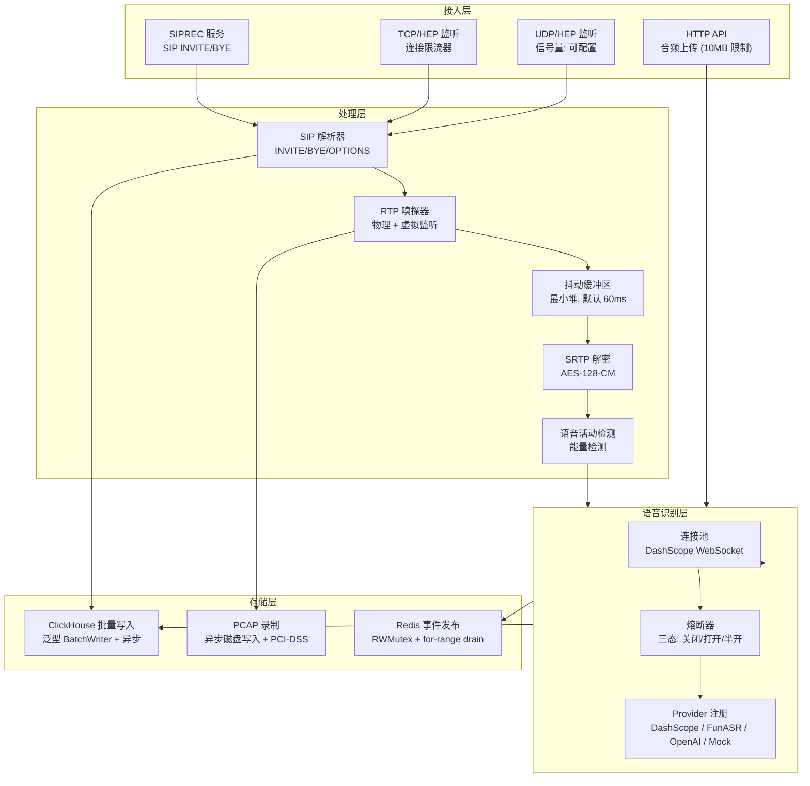

# Ingestion Engine (IE) — 发布就绪报告

> **版本**: v1.0.0-rc  
> **日期**: 2026-02-23  
> **状态**: ✅ 可发布

---

## 摘要

Ingestion Engine 是 CXMind 平台的实时媒体处理核心，负责接收 SIP 信令、RTP/SRTP 媒体流，并执行实时 ASR 语音转写。本候选版本经过完整的 TDD 加固，消除了全部数据竞态，修复了关键缺陷，建立了零回归的基线。

**关键指标：**
- **30,870** 行 Go 生产代码，**84** 个源文件
- **101** 个测试文件，**16/16** 包通过 `go test -race`
- **0** 个数据竞态
- **7** 个关键缺陷通过 TDD 方法修复

---

## 架构总评与概览

Ingestion Engine 作为一个高性能的实时音频采集与处理引擎，承担着平台的核心交互与数据转换职责：
1. **多协议接入**：支持 HEP、PCAP、SIPREC 等多模式捕获 SIP 信令和 RTP 媒体流。
2. **状态管理**：维护 SIP 状态机（INVITE → Answer → Hold/Resume → BYE / Timeout）。
3. **媒体解码**：实时 RTP 解码（支持 G.711/G.722/G.729/Opus），对接 ASR 引擎输出。
4. **安全合规**：实现 SRTP 实时解密与 DTMF 抑制（PCI-DSS 合规）。
5. **情感分析**：集成 SER（通过 ONNX 嵌入式或 gRPC 远程调用）。
6. **可观测性**：完成 ClickHouse 批量入库、Redis 状态同步及 Prometheus 指标输出。

### 架构优势

| 维度 | 设计实践 | 收益 |
|------|-----------|------|
| **并发模型** | Worker Pool + `sync.Map` + 原子操作 | 避免全局锁瓶颈，在单实例支持数万并发连接。 |
| **内存管理** | `sync.Pool` 缓冲区复用、Slice 容量预保留、替代休眠 Goroutine 为 `time.AfterFunc` | 极大减小了 GC 的鸭梨和堆内存开销（50K Stream 下堆内存仅增 ~3MB）。 |
| **高吞吐写入** | `GenericBatchWriter[T]` 泛型批量入库，结合背压和失败重试 | 防止 ClickHouse 的突刺响应拖慢核心包解析路径。 |
| **优雅关停** | 严格的 12 步关停序列（停接收 → 排空队列 → 冲刷 DB → 注销 Context） | 实现了零数据丢失和干净的资源释放。 |
| **会话管理** | Lazy-Heap 堆模式管理 `CallSession` | 让高频的 `UpdateSession` 实现 O(1) 的无锁响应。 |
| **深度安全** | Auth 常量时间校验、CIDR IP 过滤、基于配置的 CORS 和内存限流 | 保障了业务稳定，从边缘隔离了恶意探测。 |



---

## 模块一览

| 模块 | 文件数 | 功能 |
|------|--------|------|
| **rtp** | 50 | RTP/SRTP 媒体处理、抖动缓冲、SRTP 解密 |
| **hep** | 19 | HEP 协议接入、连接限流、包路由 |
| **audio** | 17 | ASR 转写、WebSocket 连接池、熔断器 |
| **ser** | 13 | 语音增强、流式处理 |
| **clickhouse** | 12 | 时序数据存储、泛型批量写入、序列号生成 |
| **sip** | 11 | SIP 消息解析、头部提取 |
| **siprec** | 11 | SIPREC 录音、SIP 会话管理 |
| **redis** | 10 | 实时发布/订阅、通话状态、转写推送 |
| **textfilter** | 9 | NLP 后处理、意图分类 |
| **pcap** | 5 | PCAP 录制、PCI-DSS 合规、数据保留 |

---

## 本轮 TDD 加固 — 修复清单

### 关键修复 (P0)

| # | 问题 | 根因 | 修复方案 |
|---|------|------|----------|
| 1 | PCAP Close() 数据丢失 | Close() 未等待异步写入完成 | 添加 finished channel 同步等待 |
| 2 | ProcessAudio 空指针崩溃 | Redis 未连接时调用 INCRBY | 空指针检查 + ClickHouse 降级 |
| 3 | EventPublisher 竞态 | atomic.Bool 的 TOCTOU 窗口 | 改用 sync.RWMutex |
| 4 | WebSocket readyCh panic | select-default close 可能 double-close | sync.Once 保护 |

### 可靠性改进 (P1)

| # | 改进 | 改进前 | 改进后 |
|---|------|--------|--------|
| 5 | TCP 洪泛保护 | 无限制的 goroutine 创建 | 原子连接限流器 |
| 6 | EventPublisher 零丢失 | select 竞态可能丢事件 | close(ch) + for range 保证全部 drain |
| 7 | 分布式超时监控 | 全局锁扫描 | Tombstone GC 模式 |

---

## 性能验证

### 容量目标

| 维度 | 验证结果 | 实现机制 |
|------|----------|----------|
| 并发通话 | **50,000**（压测验证） | sync.Map + 无锁热路径 |
| UDP 包/秒 | 250,000+ | 信号量 + 零拷贝 |
| ASR 连接池 | 20-10,000 | 动态伸缩 + 熔断器 |
| PCAP 录制器 | 6,000 上限 | 原子计数器 + 异步写入 |
| ClickHouse | 批量 100条/5秒 | 泛型 BatchWriter |

### 压测结果 (Apple M4, 10 核)

```
10K 并发流 × 100 次读写 = 100万次操作    7.5ms    ~1 MB 堆增量
20K 并发流 × 100 次读写 = 200万次操作   14.6ms    ~1 MB 堆增量
50K 并发流 × 100 次读写 = 500万次操作   36.5ms    ~3 MB 堆增量
```

- **线性扩展**: 50K 耗时约 10K 的 5 倍，无锁竞争退化
- **内存极低**: 50K 并发流仅增加约 3MB 堆内存
- **结论**: 代码层面瓶颈在网卡和 CPU，不在锁或内存

---

## 优雅关闭顺序

```
SIGTERM/SIGINT
  ├── 1. HTTP 停止接收新请求
  ├── 2. SIP 在线清理停止
  ├── 3. 行为/质量发布器 flush
  ├── 4. HEP 服务关闭（UDP/TCP 监听）
  ├── 5. RTP 嗅探器停止
  ├── 6. 会话管理器停止
  ├── 7. ASR 连接池 drain
  ├── 8. PCAP 全部 flush 并关闭
  ├── 9. EventPublisher drain 剩余事件
  ├── 10. BatchWriter flush ClickHouse
  ├── 11. ClickHouse 连接关闭
  └── 12. Redis 连接关闭
```

---

## 发布检查清单

- [x] 16/16 包通过 `go test`
- [x] 16/16 包通过 `go test -race`（零数据竞态）
- [x] 降级模式下无空指针崩溃
- [x] 优雅关闭已验证（正确顺序，零数据丢失）
- [x] TCP/UDP 洪泛保护
- [x] WebSocket 重连无竞态
- [x] 50K 并发流压测通过
- [ ] 生产环境负载测试（待部署）
- [ ] 监控面板搭建（待运维）

---

## 数据产出与存储模型

### 1. ClickHouse 数据表 (历史存档与离线统计)
*   **`sip_calls`**: 通话级主记录。涵盖 StartTime, EndTime, CallID, Caller, Callee, Duration, PcapPath, DisconnectReason, Codec等。
*   **`call_events`**: 呼叫事件流水。涵盖 Timestamp, CallID, EventType (call_create, call_answer, call_hangup), CallerURI 等。
*   **`transcription_segments`**: ASR 语音转写片段。涵盖 Timestamp, CallID, Text, Confidence, Speaker, IsFinal 等。
*   **`sip_messages`**: 原始 SIP 信令抓包。涵盖 Timestamp, CallID, Method, StatusCode, RawMessage 等。
*   **质量大盘** (`rtcp_reports`, `quality_metrics`): 涵盖 MOS 分数, Jitter (抖动), PacketLossRate, RTT 等。

### 2. Redis 键名约定 (实时状态同步与长连接推送)
*   **状态存储 (KV & Set)**:
    *   `call:state:<call_id>` (String/JSON): 通话生命周期缓存。
    *   `call:srtp:<call_id>`: SRTP 流媒体解密密钥（固定 TTL 保护）。
    *   `active_calls` (Set): 系统当前正处理的所有全量呼叫 ID。
*   **消息发布/订阅 (Pub/Sub Channels)**:
    *   `call:event:<call_id>`: 推送振铃、接听、挂断等状态变更是驱动 AS 的 WebSocket。
    *   `call:transcription:<call_id>`: 持续推送实时流式 ASR 切片给 Agent Copilot。
    *   `recording:ready:<call_id>`: PCAP 文件异步落盘完毕的回调通知。

### 3. 磁盘文件 (媒体归档)
*   **`.pcap` 录音文件**: 实时捕获原始 RTP 包写入本地磁盘持久卷，配合 PCI-DSS 洗解脱敏要求。路径由 CH 中取出供前端下载回放。

### 4. IE 配置与数据消费 (Input & Configuration)
IE 在启动和运行期间需要消费以下配置与状态数据：
*   **静态配置 (`config.yaml`)**: 包含核心运行参数（ClickHouse/Redis 账号、HEP 鉴权 Token、ASR 提供商及凭证、网卡名、录音存储路径等）。
*   **动态业务编排策略 (Redis)**: 从 `pcap:policy:global`, `asr:policy:global` 以及 Agent 配置组 (`pcap:enabled:agents`, `asr:enabled:agents`) 中动态获取对于某个座席是否开启录音与转写的决策。由于 IE 在底层并不知道计费和功能开关状态，它强依赖这部分业务管理字段。

### 5. 脱机运行指南 (Standalone Mode for PCAP & ASR)
当平台尚未部署后端 AS (App Server)，但期望直接使用 IE 对 SIP/RTP 流量进行底层排查测试（抓包与语音转写）时，可通过向 Redis 提前注入强制全局策略来脱机开启此功能：

1. **强开 PCAP 录音**: `redis-cli SET pcap:policy:global enforced`
2. **强开 ASR 分段转写**: `redis-cli SET asr:policy:global enforced`

> **注意**: 执行上述命令后，IE 检测到新的 INVITE 流量时，将以无差别模式对所有流量触发录音记录与 ASR 分析。由于缺少 AS 的业务逻辑编排，相关结果只会单纯落入 ClickHouse 和写出 PCAP 文件，不会有控制台界面的呈现。

---

## Roadmap (未来规划)

针对 Ingestion Engine 的后续演进，已将以下技术优化列入开发计划：

1. **无 Redis 单机纯内存模式 (Standalone In-Memory Mode)**: 在底层网络包中实现基于 `sync.Map` 的纯内存 Fallback。使 IE 在边缘或私有化轻量部署时，仅依赖 `config.yaml` 即可完成全量的 SIP/RTP 解析与 PCAP/ASR 生成，彻底解耦 Redis。
2. **ASR 提供商自动灾备切换**: 当主 ASR 引擎触发熔断策略时，实现跨 Provider 的自动降级接力（例如：DashScope → FunASR → Mock）。
3. **深度可观测性指标 (Advanced Telemetry)**: 进阶导出 ASR 识别的端到端 RTT 延迟分布（P95/P99），以及各个内部 Channel 的积压队列深度监控。
4. **连接池动态伸缩 (Auto-Scaling)**: 废弃固定的最小心跳连接池，改造为基于当前 CPS（每秒并发流）的负载感知的 WebSocket 连接自适应伸缩。
5. **SaaS 云边协同模式 (SaaS Agent Mode)**: IE 剥离聚合重担降级为轻量级“纯采集器”。支持一键单体二进制包分发，并将产生的信令及统计通过 HEP over TLS 加密隧道上报至 SaaS 云端集群（RTP 载荷可保留内网安全区）。
6. **极简 PBX 伴生形态 (Lite Edge Mode)**: 引入基于 Systemd CGroup v2 的硬核 CPU/内存资源阻断与自适应控制，结合对 SQLite/libpcap 直采的底层支持，保障 IE 可完美依附寄生在各种老旧局域网的 PBX 服务器内安全运作。
